# Ignite 2018 Tour DevOps Session - Deploy your code faster yet safer (or something like that)

This is the demo script for the DevOps session. In this session, we will cover

- creating a CI Yaml based pipeline from Github to Azure Pipelines.
- adding advanced devops best practices with AB Testing
- Adding automated approval gates between stages using Azure Monitoring as a quality gate
- Fast track starting a project for any language using Azure DevOps Project
- Walk through real world build and release pipelines for Tailwind Trading.

## Setup
This session's demos are done all using the browser. Open up an instance of your favorite browser and have the following tabs

1. `Tab 1 - Git hub repo for tailwind front end` https://github.com/abelsquidhead/AbelTailWindFrontEnd 

1. `Tab 2 - Tailwind Front End App Service in Portal` https://ms.portal.azure.com/#@microsoft.onmicrosoft.com/resource/subscriptions/e97f6c4e-c830-479b-81ad-1aff1dd07470/resourceGroups/AbelIgnite2018WServers/providers/Microsoft.Web/sites/AbelTailWindFrontEnd4/appServices

1. `Tab 3 - Application Insight for TailWind Traders Staging Environment` https://ms.portal.azure.com/#@microsoft.onmicrosoft.com/resource/subscriptions/e97f6c4e-c830-479b-81ad-1aff1dd07470/resourceGroups/AbelIgnite2018WServers/providers/microsoft.insights/components/AbelTailWindFrontEnd4Staging/overview 

1. `Tab 4 - Azure Portal` https://ms.portal.azure.com/#@microsoft.onmicrosoft.com/dashboard/private/a2cca8d5-8dd2-4059-aba9-a8934116167c

1. `Tab 5 - Ignite 1 DevOps Project Dashboard` https://ms.portal.azure.com/#@microsoft.onmicrosoft.com/resource/subscriptions/e97f6c4e-c830-479b-81ad-1aff1dd07470/resourceGroups/VstsRG-AzureDevOpsDemo-a-ed75/providers/microsoft.visualstudio/account/AzureDevOpsDemo-a/project/AbelIgnite2018Tour1
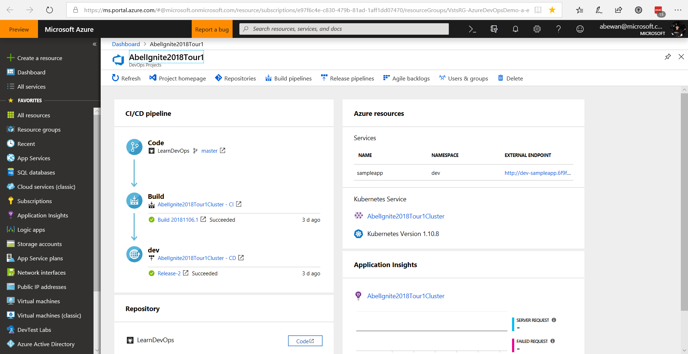
1. `Tab 6 - Ignite 2 DevOps Project Dashboard` https://ms.portal.azure.com/#@microsoft.onmicrosoft.com/resource/subscriptions/e97f6c4e-c830-479b-81ad-1aff1dd07470/resourceGroups/VstsRG-AzureDevOpsDemo-a-ed75/providers/microsoft.visualstudio/account/AzureDevOpsDemo-a/project/AbelIgnite2018Tour2

1. `Tab 7 - Tailwind Build All Up` https://dev.azure.com/azuredevopsdemo-a/AbelTailwindInventoryService/_apps/hub/ms.vss-ciworkflow.build-ci-hub?_a=edit-build-definition&id=27
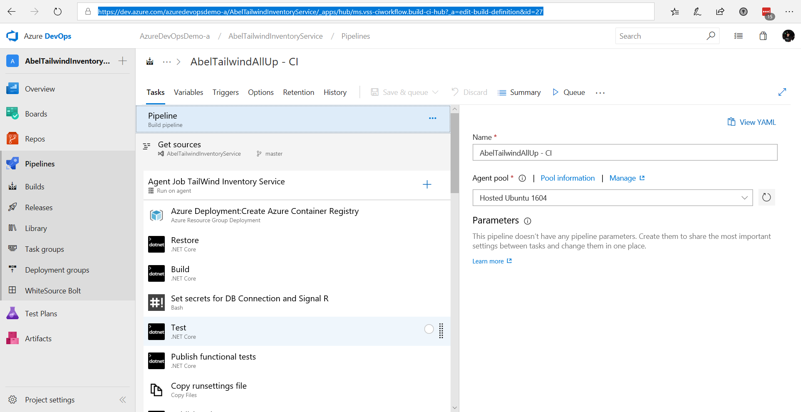 
1. `Tab 8 - Tailwind Release All Up` https://dev.azure.com/azuredevopsdemo-a/AbelTailwindInventoryService/_releaseDefinition?definitionId=1&_a=definition-pipeline

1. `Tab 9 - Release Gate Docusign Example`
https://msvstsdemo-a.visualstudio.com/YoCoreDemo/_releaseProgress?releaseId=10&_a=release-pipeline-progress

1. `Tab 10 - Release Gate Dynatrace Unbreakable Pipeline Pass`
https://msvstsdemo-a.visualstudio.com/AbelUnbreakablePipelineDemo/_releaseProgress?releaseId=275&_a=release-pipeline-progress
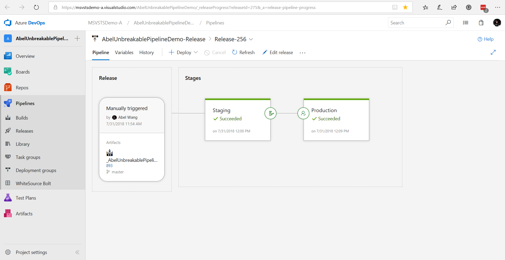
1. `Tab 11 - Release Gate Dynatrace Unbreakable Pipeline Fail`
https://msvstsdemo-a.visualstudio.com/AbelUnbreakablePipelineDemo/_releaseProgress?releaseId=276&_a=release-pipeline-progress
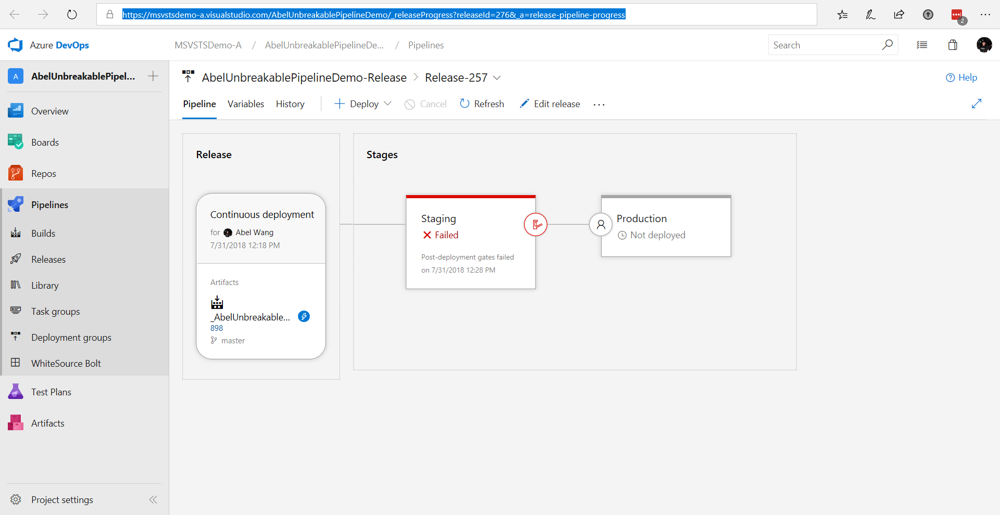

Open up another instance of a different browser. If you opened up the first set using chrome, open up another browser using firefox or edge and in this browser have 2 tabs

1. `Tab 1 - Tailwind Traders Staging` https://abeltailwindfrontend4staging.azurewebsites.net/

2. `Tab 2 - Tailwind Traders Production` https://abeltailwindfrontend4.azurewebsites.net/

## CLEANUP

1. Delete build and release pipelines for dev.azure.com/azuredevopsdemos-a/AbelTailWind
    - abelsquidhead.AbelTailwindFrontEnd
    - abelsquidhead.AbelTailWindFrontEnd - CD 
1. Change Testing In Production for ABTest slot to 0%
1. Delete ABTest slot
1. Delete az-pipelines.yml file
1. go to `/src/style.css` and change background color. Uncomment line 10, comment line 11
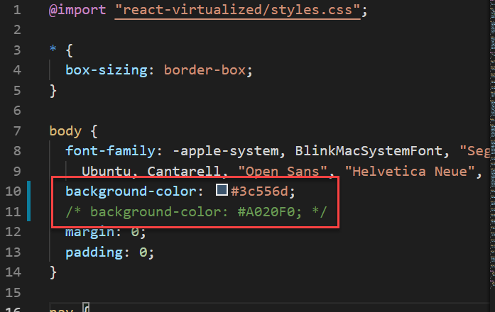

## Session script
1. I am so excited to be here today to talk to you all about DevOps. Now, I know some of you are thinking, cool DevOps! And some others are probably thinking, DevOps? Who cares? That's just CI/CD Pipelines right? Why should I care about that?
 

 1. I can give you all the reasons and I can pull out charts and graphs to back up my statements. But I wanted to show you a short film that really personifies the difference of before and after DevOps
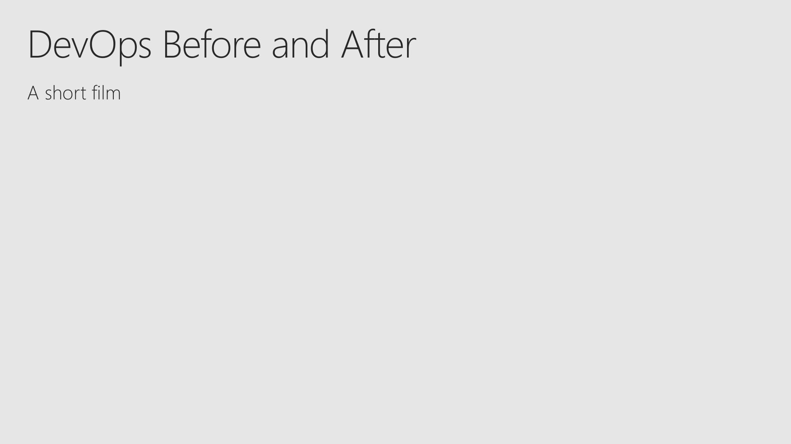

1. 

1. And THAT is why we need to do DevOps!!! NOT the way we used to. All hitting servers with hammers tryng to get our code to deploy once a year. We need to be a well oiled machine like that pit crew! Continuously delivering value!

1. Now I've mentioned DevOps a lot, but what exactly is DevOps. I bet if I ask 10 people in this room what DevOps is, we will get 10 different responses. And I'm not saying anyone elses definition is wrong. But in order to frame this conversation we are having, let me give you Microsoft's Definintion of DevOps
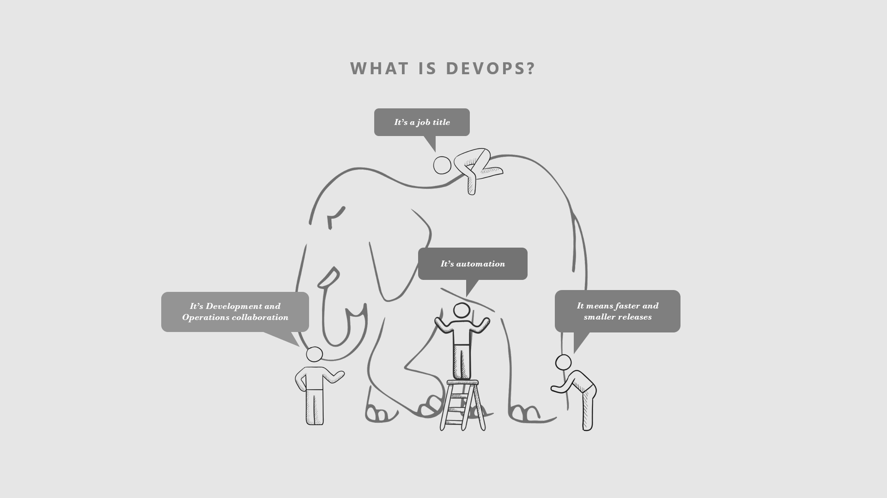

1. At Microsoft, DevOps is something very specific. Devops is the union of people, process and products to enable the continous delivery of value to our end users. Now notice I said that super carefully. I didn't say continously deliver code. Because what will that give us, just piples and piles of code that's no use to our end users. And notice, I didn't even say continously deliver features. Because we could be delivering feature after feature, but if we are not delivering value, we are just wasting time!

1. Now why is this important? Why do should we care about DevOps. The speed of business today is SO fast, that we must adopt DevOps best practices just to keep up. If we don't, our competitors either have or they will adopt DevOps best practices. And whey they do, they WILL out innovate us and they WILL render us obsolete. And no one wants to be rendered obsolete.
.png)
1. This isn't just theory anymore. We now have the cold hard imperical facts that cleary demonstrate this. Adopting DevOps best practices means you are faster to market, you have lower failure rates. Much faster lead time for changes and much faster Mean time to recover. And what does all of this translate into? INCREASED REVENUE!
. 

1. To implement DevOps successfully, you have to attack all three pillars when writing software. You must address the People, the Process and the Products

1. For the people portion, that's the toughest change to make. This is a cultural shift that needs to take place in the organization. Where everybody from the top down all become hyperfocused on continuously delivering value. I don't want to hear, well, that's how we always do things from anyone. Everyone needs to focus on continuously delivering vaue. 

1. For the process, we need to have a process that will let us interate fast enough, yet still deliver code of high enough quality. So what does that mean? I need to be able to plan my sprints, and I need to be able to check my code in and out while tracking against the work I'm doing. And as I'm checking code in and out? Builds need to kick off. Automated Tests need to be run. Security scans need to happen. And if the build are good, an automated system needs to pick up my bits and deploy them into my Dev, QA, UAT all the way out in to production. And why does this need to be automated? Potentially, this can happen many times a day! So we need to make sure the process is consistent and repeatable. Every single time like clock work. And once the code reaches production, it doesn't end there. We still need to be able to monitor our code in production. We need to know things like, is my app up or down, is my app performing well, and what are users really doing in my app? Because answers to those questions let me know if I'm delivering vaue to my end users. And if I am, we can double down on those types of activities in the next sprint. And if we aren't, then we can quickly reprioritize our backlog and course correct.

1. Now all of this requires the right products and tools to help enable all of this. So we need tools that will let us track our work throughout our sprint. We need source control systems that can corrolate our work to our checkins. We need automated build and release systems that can build on everycheckin, run all of our unit tests and automate deployment all the way to production. And we need systems in place to monitor our app in production. 
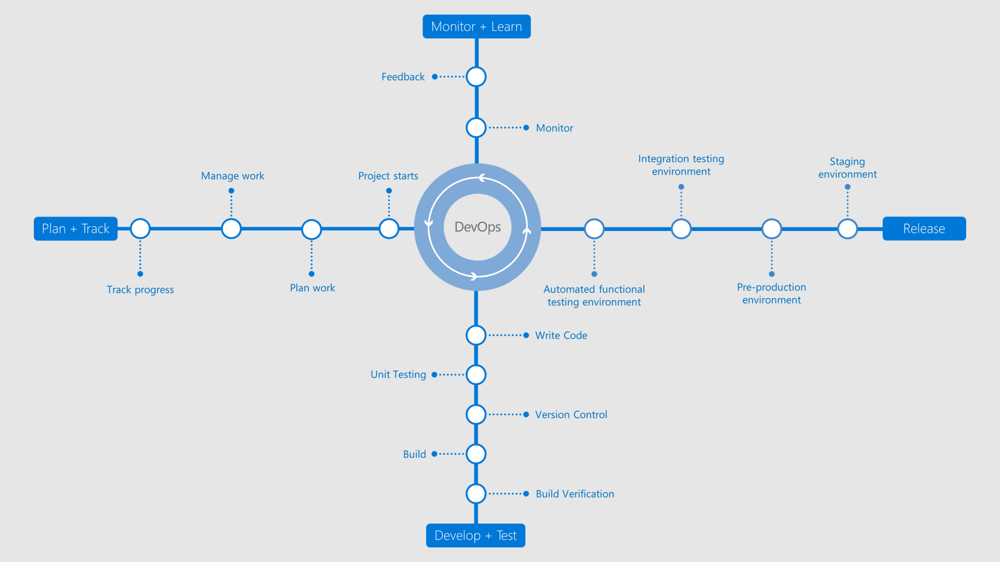

1. Out there in the world, there are all sorts of tools that do these things. And Azure is an open system, which means you can keep using all of the DevOps tools you are most familiar with.

1. However, you can replace ALL of them with just one product. Azure DevOps

1. Azure DevOps is literally everything you need to take an idea and turn that idea into a working piece of software in the hands of your end users, for ANY language targeting ANY platform. Azure DevOps is a suite of 5 sepparate products that work SEAMLESSLY together. There's a work item tracking product called Azure Boards, where you can track any unit of work in your software project with visual tools to help you manage all of your work. There is Azure Pipelines, where you can build yout your CI/CD pipelines for any language targeting any platform. There is Azure Repos where you can host your own Git repo or a centralized version control system. There is Azure Test Plans for you to create, plan and run all of your manual tests. And finally there is Azure Artifacts, where you can host your package management systems, whethere they be nuget, maven or even generic packages.

1. In today's session, we will be concentrating on Azure Pipelines, where we will deploy our code faster yet safer!
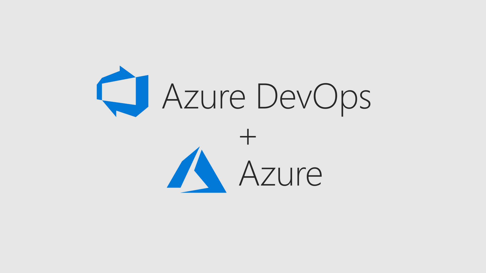

1. Bring up main browser with all the tabs and bring up tab 

   So the code for TailWind is all in github, and we need to build a CI/CD pipeline from github to Azure Pipelines. That's super easy to do with the Azure Pipelines market place extension. Lets go into the marketplace and search for the Azure Pipeline Extension

   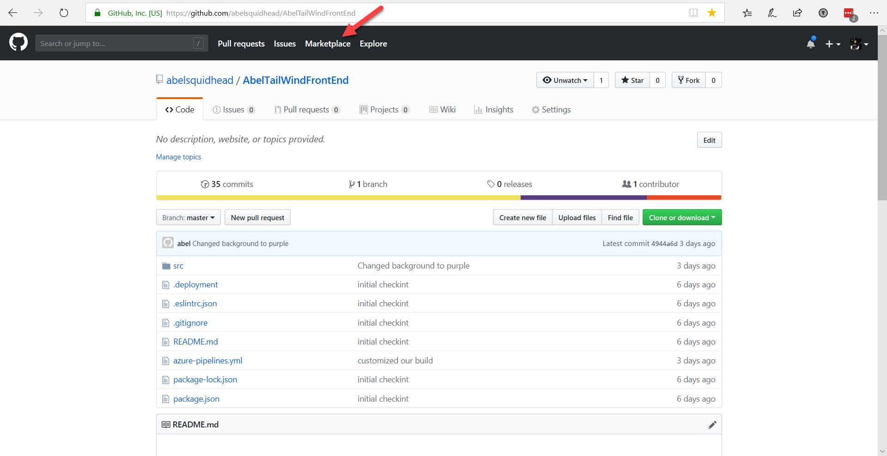

   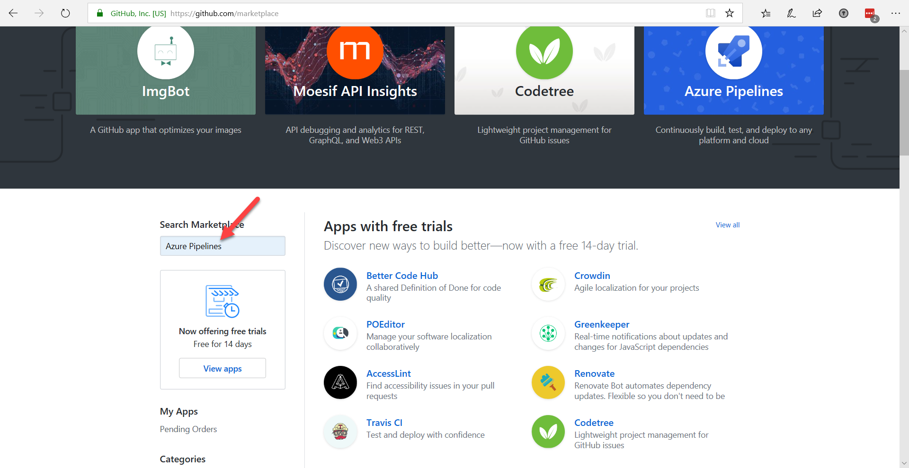

   

1. I've already installed the extension so let's just go in and configure this

   

   

   

1. And we will configure it to create a CI pipeline for our Tailwind Front End repo
    
   

1. This takes us to the login screen of Azure DevOps

   

   

   